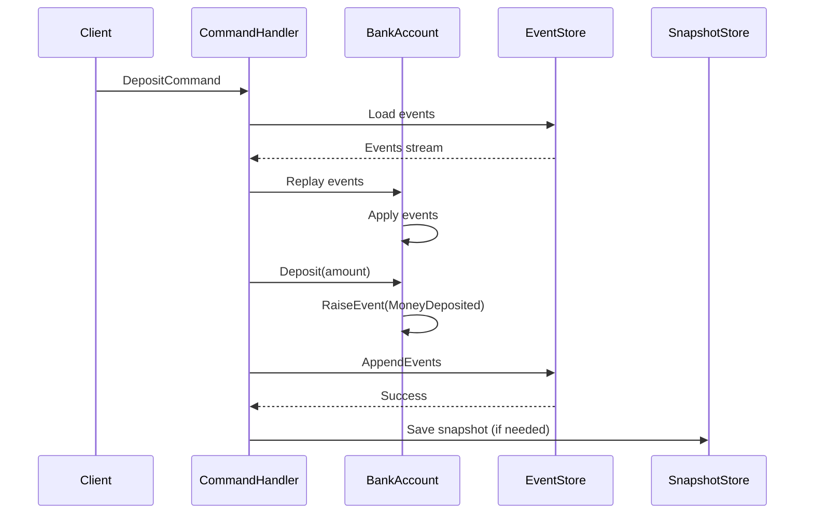

# Event Sourcing Basic Example

Простой пример использования Event Sourcing в Potter Framework на примере банковского счета.

## Что демонстрирует пример

- ✅ Создание Event Sourced агрегата (BankAccount)
- ✅ Генерация и применение доменных событий
- ✅ Сохранение событий в EventStore (PostgreSQL)
- ✅ Восстановление состояния агрегата через replay
- ✅ Использование снапшотов для оптимизации
- ✅ Обработка оптимистичной конкурентности
- ✅ CQRS команды и обработчики

## Архитектура



## Быстрый старт

```bash
# Запустить PostgreSQL
make docker-up

# Применить миграции
make migrate

# Запустить приложение
make run

# Тестовые запросы
curl -X POST http://localhost:8080/accounts \
  -d '{"account_number":"ACC001","owner_name":"John Doe"}'

curl -X POST http://localhost:8080/accounts/ACC001/deposit \
  -d '{"amount":1000}'

curl http://localhost:8080/accounts/ACC001
```

## Структура проекта

```
eventsourcing-basic/
├── domain/           # Event Sourced агрегаты
│   ├── bank_account.go
│   └── events.go
├── application/      # CQRS команды и handlers
│   ├── bank_account_aggregate.go
│   └── handler.go
├── infrastructure/   # Репозитории и адаптеры
│   ├── event_store.go
│   └── snapshot_store.go
├── cmd/server/       # Точка входа
│   └── main.go
├── migrations/       # SQL миграции
│   └── 001_create_event_store.sql
├── docker-compose.yml
├── Makefile
└── README.md
```

## Ключевые концепции

### Event Sourced Aggregate

Агрегат восстанавливает свое состояние из событий:

```go
func (a *BankAccount) Apply(event events.Event) error {
    switch e := event.(type) {
    case *MoneyDepositedEvent:
        a.balance += e.Amount
    }
    return nil
}
```

### Snapshots

Снапшоты создаются каждые 100 событий для оптимизации:

```go
config := eventsourcing.DefaultRepositoryConfig()
config.UseSnapshots = true
config.SnapshotFrequency = 100

factory := func(id string) *application.BankAccountAggregate {
    return application.NewBankAccountAggregate(id)
}

repo := eventsourcing.NewEventSourcedRepository[*application.BankAccountAggregate](
    eventStore,
    snapshotStore,
    config,
    factory,
)
```

## Тестирование

```bash
# Unit тесты
make test

# Integration тесты
make test-integration

# Benchmark
make benchmark
```

## Troubleshooting

См. основную документацию: `framework/eventsourcing/README.md`

