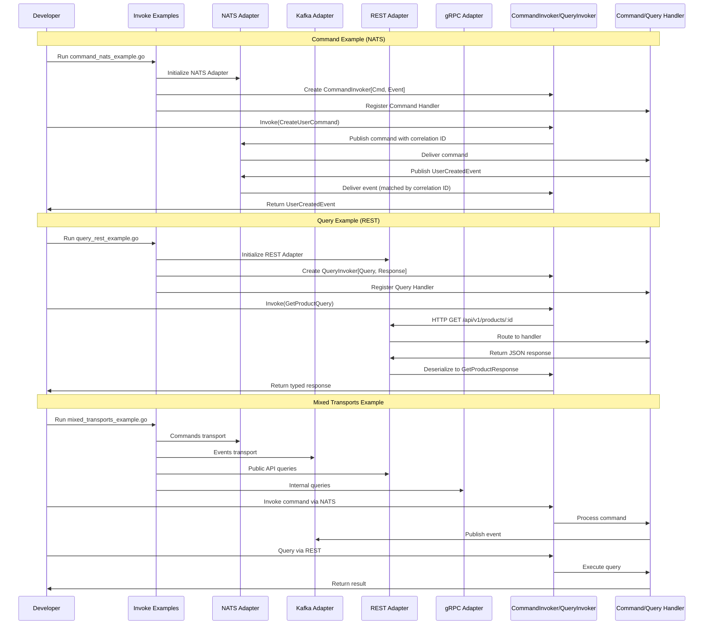

# Invoke Module Examples

Полноценная коллекция рабочих примеров использования модуля Invoke с различными транспортами.

## Обзор

Примеры демонстрируют использование `CommandInvoker` и `QueryInvoker` с разными транспортами:

- **Commands**: NATS (с EventBus), Kafka (с Kafka Events)
- **Queries**: NATS Request-Reply, Kafka Request-Reply, REST HTTP, gRPC
- **Advanced**: Комбинация всех транспортов в одном приложении

## Требования

- Go 1.21+
- Docker и Docker Compose (для запуска инфраструктуры)
- Доступные порты: 4222 (NATS), 9092 (Kafka), 6379 (Redis), 5432 (PostgreSQL), 8080 (REST), 50051 (gRPC)

## Быстрый старт

```bash
# 1. Запустить инфраструктуру
make start-infra

# 2. Запустить все примеры
make test-all

# 3. Или запустить конкретный пример
make test-command-nats
```

## Примеры

### Commands

#### NATS с EventBus

**Файл:** `command_nats_example.go`

**Что демонстрируется:**
- Fire-and-await паттерн с EventBus
- Использование `CommandInvoker` с NATS транспортом
- Обработка успешных и ошибочных событий
- Распространение correlation ID через контекст

**Запуск:**
```bash
make test-command-nats
# или
go test -v -run ExampleCommandInvokerWithNATS
```

**Архитектура:**
```
Client -> CommandInvoker -> AsyncCommandBus -> NATS (commands.*)
                                                  |
                                                  v
Handler <- NATS Subscribe (commands.*) -> EventPublisher -> EventBus
                                                  |
                                                  v
EventAwaiter <- EventBus (events.*) <- Match correlation ID -> Client
```

#### Kafka с Kafka Events

**Файл:** `command_kafka_example.go`

**Что демонстрируется:**
- Kafka pub/sub для команд и событий
- Использование `KafkaEventAdapter` для публикации событий
- Настройка compression, idempotent writes, partitioning
- Обработка DLQ для failed messages
- Детальный анализ через `InvokeWithBothResults()`

**Запуск:**
```bash
make test-command-kafka
# или
go test -v -run ExampleCommandInvokerWithKafka
```

### Queries

#### NATS Request-Reply

**Файл:** `query_nats_example.go`

**Что демонстрируется:**
- NATS Request-Reply паттерн
- Использование `QueryInvoker` с NATS транспортом
- Пакетные запросы через `InvokeBatch()`
- Валидация результатов
- Обработка timeout и ошибок

**Запуск:**
```bash
make test-query-nats
# или
go test -v -run ExampleQueryInvokerWithNATS
```

#### Kafka Request-Reply

**Файл:** `query_kafka_example.go`

**Что демонстрируется:**
- Kafka Request-Reply с correlation ID
- Временные reply topics
- Consumer groups для масштабирования
- Cleanup reply topics после получения ответа

**Запуск:**
```bash
make test-query-kafka
# или
go test -v -run ExampleQueryInvokerWithKafka
```

#### REST HTTP

**Файл:** `query_rest_example.go`

**Что демонстрируется:**
- HTTP REST endpoints с Gin
- Интеграция с `QueryBus`
- Query parameters, headers, authentication
- Content negotiation (JSON/XML)
- Middleware для логирования, метрик, CORS

**Запуск:**
```bash
make test-query-rest
# или
go test -v -run ExampleQueryInvokerWithREST
```

#### gRPC

**Файл:** `query_grpc_example.go`

**Что демонстрируется:**
- gRPC services с protobuf
- Интеграция с `QueryBus`
- Server-side и client-side streaming
- gRPC status codes и metadata
- Interceptors для логирования, метрик, authentication
- Health checking и reflection

**Запуск:**
```bash
make test-query-grpc
# или
go test -v -run ExampleQueryInvokerWithGRPC
```

### Advanced

#### Mixed Transports

**Файл:** `mixed_transports_example.go`

**Что демонстрируется:**
- Использование разных транспортов одновременно:
  - NATS для команд (легковесные, быстрые)
  - Kafka для событий (высокая пропускная способность)
  - REST для синхронных запросов (публичный API)
  - gRPC для внутренних запросов (производительность)
- Разные SubjectResolver для каждого транспорта
- Единый EventBus для координации
- Метрики для всех транспортов
- Graceful shutdown в правильном порядке

**Запуск:**
```bash
make test-mixed
# или
go test -v -run ExampleMixedTransports
```

## Структура примеров

Каждый пример следует единой структуре:

1. **Определение типов** - команды/запросы и события/результаты
2. **Создание handler'ов** - обработка команд/запросов с публикацией событий
3. **Инициализация транспорта** - настройка NATS/Kafka/REST/gRPC адаптеров
4. **Создание invoker'ов** - настройка CommandInvoker/QueryInvoker
5. **Регистрация handlers** - подписка на команды/запросы
6. **Использование** - отправка команд/запросов и получение результатов
7. **Graceful shutdown** - корректное завершение всех компонентов

## Docker Compose

Файл `docker-compose.yml` содержит все необходимые сервисы:

- **NATS** (порт 4222) - для команд и request-reply
- **Kafka + Zookeeper** (порт 9092) - для pub/sub и событий
- **Redis** (порт 6379) - для кеширования в query examples
- **PostgreSQL** (порт 5432) - для персистентности

### Запуск инфраструктуры

```bash
# Запуск всех сервисов
make start-infra

# Остановка всех сервисов
make stop-infra

# Очистка volumes и данных
make clean
```

### Мониторинг

- **NATS Monitoring**: http://localhost:8222
- **Kafka UI** (опционально): http://localhost:8080

## Troubleshooting

### NATS не запущен

**Ошибка:** `connection refused` или `failed to connect to NATS`

**Решение:**
```bash
# Проверить, запущен ли NATS
docker ps | grep nats

# Запустить инфраструктуру
make start-infra

# Подождать несколько секунд для инициализации
sleep 5
```

### Порт занят

**Ошибка:** `bind: address already in use`

**Решение:**
```bash
# Найти процесс, использующий порт
lsof -i :4222  # NATS
lsof -i :9092  # Kafka
lsof -i :8080  # REST

# Остановить процесс или изменить порт в docker-compose.yml
```

### Kafka topics не создаются

**Ошибка:** `TopicNotFoundException` или timeout при создании topics

**Решение:**
```bash
# Проверить статус Kafka
docker logs kafka

# Подождать полной инициализации Zookeeper и Kafka
docker-compose up -d
sleep 30  # Kafka требует больше времени для запуска
```

### Timeout при ожидании событий

**Ошибка:** `event timeout` при вызове `Invoke()`

**Причины:**
- Handler не публикует событие с correlation ID
- Событие публикуется с другим correlation ID
- EventBus/EventAwaiter не подписан на тип события

**Решение:**
1. Проверить, что handler извлекает correlation ID из контекста:
   ```go
   correlationID := invoke.ExtractCorrelationID(ctx)
   ```
2. Убедиться, что событие публикуется с правильным correlation ID:
   ```go
   event.WithCorrelationID(correlationID)
   ```
3. Проверить подписку EventAwaiter на тип события

### Неверный тип результата

**Ошибка:** `invalid result type` при вызове `QueryInvoker.Invoke()`

**Причины:**
- QueryHandler возвращает неправильный тип
- Type assertion в QueryInvoker не проходит

**Решение:**
1. Убедиться, что QueryHandler возвращает правильный тип
2. Проверить generic параметры QueryInvoker:
   ```go
   invoker := invoke.NewQueryInvoker[GetProductQuery, GetProductResponse](queryBus)
   ```

## См. также

- [Основная документация Invoke модуля](../README.md)
- [Best Practices](../README.md#best-practices)
- [Migration Guide](../README.md#migration-guide)

## Архитектура примеров



